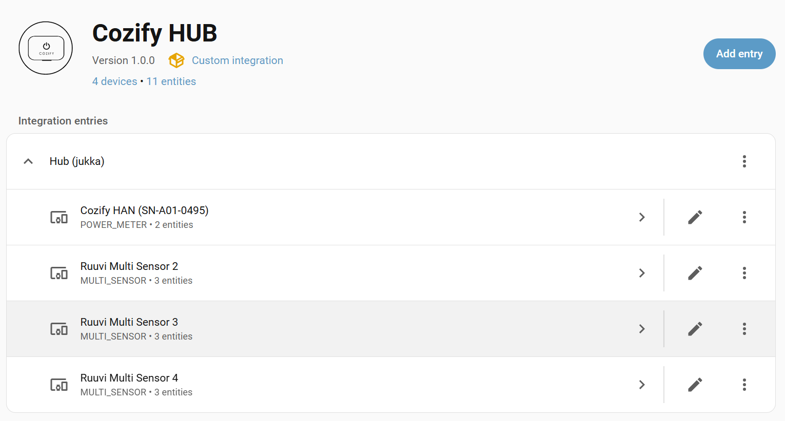

[](https://github.com/PilcQ/cozify_hub)
[](https://github.com/hacs/integration)
[](https://github.com/PilcQ/cozify_hub/stargazers)
[](https://github.com/PilcQ/cozify_hub/commits/main)
[](https://github.com/PilcQ/cozify_hub/blob/main/LICENSE)
<br />

This is still a work in progress, once more complite will be moved to official GitRepo. Still please try and let us know what you think.

# Cozify HUB — Home Assistant HACS Integration

A Home Assistant custom integration for the **Cozify HUB** product family (ION, ZEN, DIN), installable via [HACS](https://hacs.xyz/).

> **Note:** This integration is specifically for **Cozify HUB** products. For Cozify HAN products, use the separate `cozify_han` integration.


## Features

| Platform | Devices |
|---|---|
| `light` | Dimmable lights, color temperature, RGB/HS color |
| `switch` | Smart plugs, relays |
| `sensor` | Temperature, humidity, pressure, lux, CO₂, VOC, power, energy, water flow, battery, signal |
| `binary_sensor` | Motion, door/contact, smoke, moisture, CO, twilight, siren |
| `climate` | Thermostats with target temp, HVAC modes, presets |
| `cover` | Blinds with position and tilt |
| `fan` | Ventilation units (VU), fan speed control |
| `valve` | Water/gas valves with position |
| `scene` | Scene activation |

## Connection Modes

| Mode | Description | IoT Class |
|---|---|---|
| **Local** | Direct connection to HUB on LAN — faster, no internet required | `local_polling` |
| **Cloud** | Via Cozify Cloud — works remotely | `cloud_push` |



## Requirements

- Home Assistant 2024.1.0 or newer
- Cozify HUB (ION, ZEN or DIN) on your network
- Cozify account (for cloud mode or initial token retrieval)

## Installation via HACS

1. Open HACS in Home Assistant
2. Go to **Integrations** → three-dot menu → **Custom repositories**
3. Add `https://github.com/PilcQ/cozify_hub` as **Integration**
4. Search for **Cozify HUB** and install
5. Restart Home Assistant

## Configuration

Go to **Settings → Devices & Services → Add Integration → Cozify HUB**

### Local Mode
1. Choose **Local** connection mode
2. Enter your HUB's local IP address (e.g. `192.168.1.75`)
3. Enter the HUB token (from the Cozify app or obtained via cloud login)

### Cloud Mode
1. Choose **Cloud** connection mode
2. Enter your Cozify account email
3. Check your email for the OTP code
4. Enter the OTP — the integration connects and stores everything automatically
5. If you have multiple HUBs, select which one to configure

## How Authentication Works

**Cloud mode:**
1. Email + OTP → cloud token from `cloudapi.cozify.io`
2. Cloud token → hub-specific token from `/user/hubkeys`
3. Hub token stored and used for all local API calls
4. Cloud token used as `Authorization` header, hub token as `X-Hub-Key`

**Local mode:**
- Hub token used directly as `Authorization` header
- Connects to `https://<hub-ip>:8893` with self-signed SSL (cert verification disabled)

## API Details

- Local API: `https://<hub-ip>:8893/cc/1.14/`
- Cloud API: `https://cloudapi.cozify.io/ui/0.2/hub/remote/cc/1.14/`
- Poll interval: 10s (local), 30s (cloud)

## Troubleshooting

- **Cannot connect (local)** — verify the HUB is reachable: open `https://192.168.1.75:8893/hub` in browser (accept the self-signed cert warning)
- **Invalid OTP** — OTPs are single-use and expire quickly, request a new one
- **Already configured** — the integration was set up successfully, close the dialog and check Settings → Devices & Services
- Enable debug logging in `configuration.yaml`:
  ```yaml
  logger:
    default: warning
    logs:
      custom_components.cozify_hub: debug
  ```

## Changelog

### v2.0.0
- Full rewrite based on official Cozify API v2 documentation
- Added local mode (direct HTTPS to hub)
- Added cloud mode with automatic OTP authentication
- New platforms: switch, climate, fan, valve, scene
- Correct API command format (`CMD_DEVICE_ON/OFF`, `CMD_DEVICE` with state objects)
- Correct brightness/hue/saturation units (0.0–1.0 / radians)
- Parallel data fetching (devices, rooms, scenes, groups, alarms)
- Token refresh support
- Multi-hub support

### v1.0.0
- Initial release with cloud-only authentication

---
*Note: This integration is (SOON) officially supported by Cozify Oy. You are already welcome to try this...*

